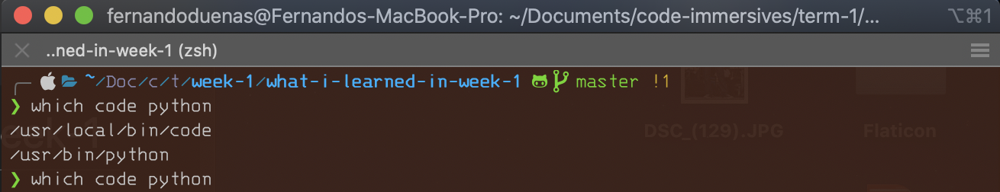
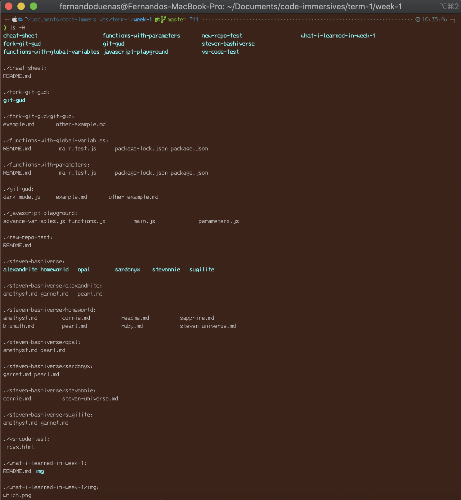
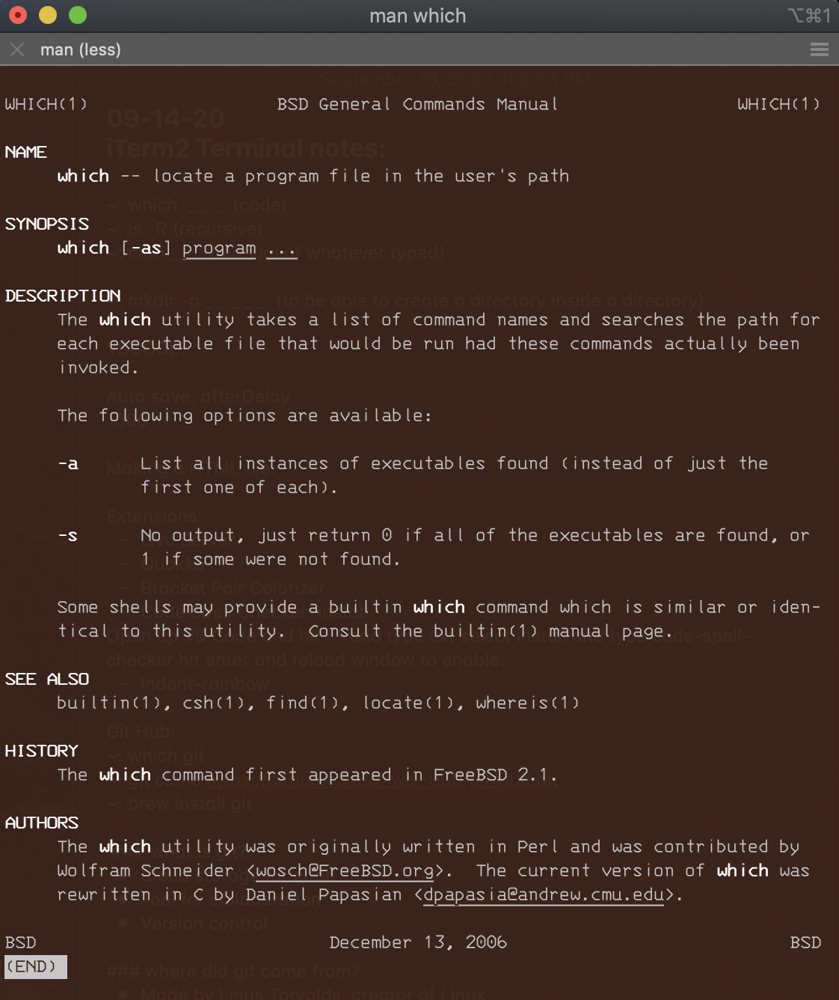
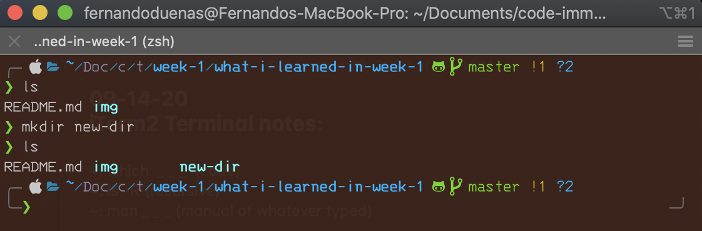
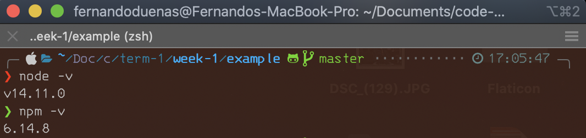
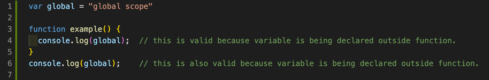
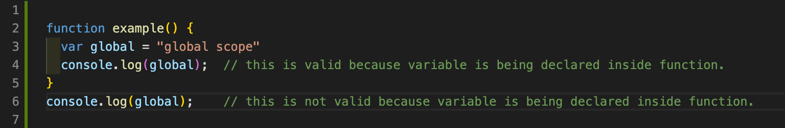
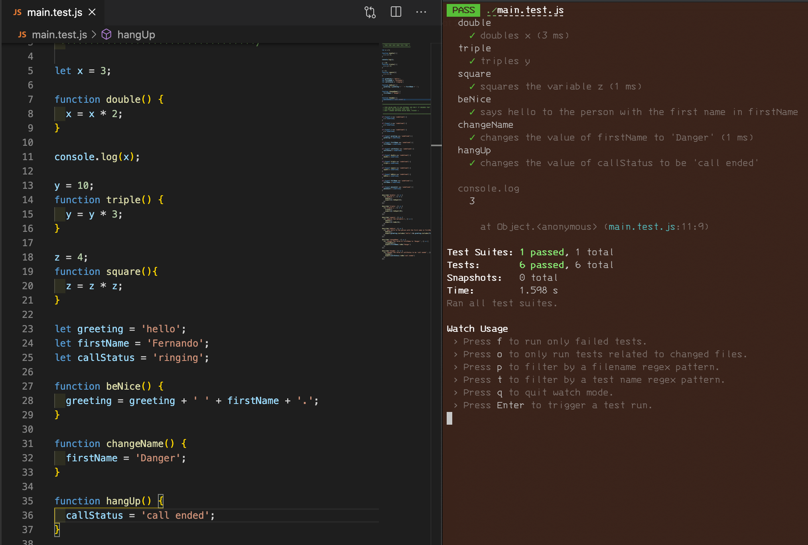
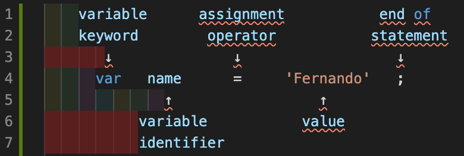
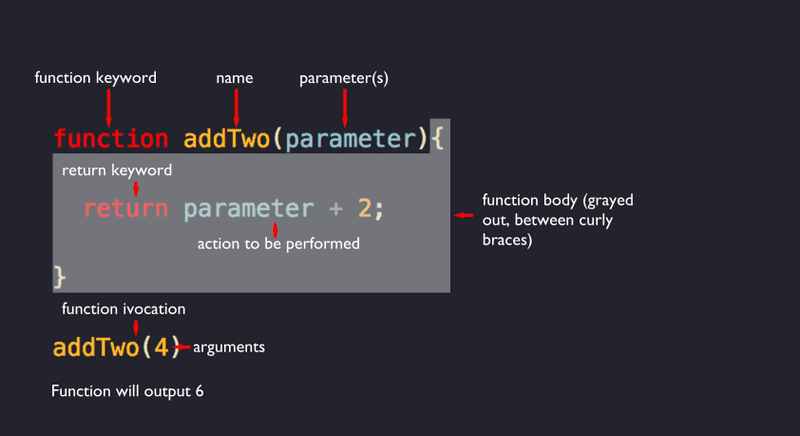

  # **`❯   ~/Doc/c/t/week-1/what-i-learned-in-week-1`**
  ###### _Fernando Duenas_
  ###### _Monday 21st, 2020_
> ## thoughts
> It has been a busy week-1, the learning curve is starting to get steep, however, the amount invested will seem greater than the return at the moment, but after the learning curve has been overcome, the return will be greater than the investment.

---

### **The Terminal (iTerm2):**

_**Terminal**_ is the _**terminal emulator**_ included in the macOS operating system by Apple. Terminal originated in NeXTSTEP and OPENSTEP, the predecessor operating systems of macOS.

_**iTerm2**_ is a _**GPL-licensed**– terminal emulator for macOS. It was derived from and has mostly supplanted the earlier "iTerm" application. iTerm2 supports operating system features such as window transparency, full-screen mode, split panes, Exposé Tabs, Growl notifications, and standard keyboard shortcuts.

_**GPL**_ is the acronym for _**GNU's General Public License**_, and it's one of the most popular open source licenses. Richard Stallman created the GPL to protect the GNU software from being made proprietary. It is a specific implementation of his "copyleft" concept.

The _**GNU General Public License**_ is a series of widely-used free software licenses that guarantee end users the freedom to run, study, share, and modify the software.

There has been a couple of more useful commands we were introduced to last week, such as;<br>

* **Syntax ↘︎**<br>

  **`❯ which [file one] [file two]`** <br>
    `which` is a shell built-in command.  it's very helpful in finding executable file's paths.

    **Example ⇲** <br>
    `❯ which code python` <br>

    **Output ⇲** <br>


    As you can see you can look up more than one by just spacing them out.
    If you want to dig deeper into this command click the link below. It will explain and show you the different parameters you can use with this command. <br>
    [Click to Dig Deeper.](https://www.howtogeek.com/450894/how-to-use-the-which-command-on-linux/)
  
* **Syntax ↘︎**<br>
  
  **`❯ ls -R`** <br>
    The command `ls` with the parameter `-R` is able to list files, directories and subdirectories. As shown below. <br>
    
    **Output ⇲** <br>


    There are many other parameters that goes along with this command such as: <br>
     `❯ ls -a -R` <br> 
    This one will list every single detail in each directory such as dot files. Here below is a link to find more info. <br>
    [Click Here.](https://linoxide.com/linux-command/20-ls-command-linux/)

* **Syntax ↘︎**<br>

  **`❯ man [option] [any command name]`** <br>
  
    The command `man` is used to display the manual of any command that is able to run in the terminal. <br>

    **Example ⇲** <br>
    `❯ man which` <br>
    Here the command displays the whole manual. <br>

    **Output ⇲** <br>


    For more info about `❯ man [any command name]` [click here](https://www.geeksforgeeks.org/man-command-in-linux-with-examples/) <br>

* **Syntax ↘︎**<br>
  
  **`❯ mkdir [option] new-dir`** <br>

    This make directory command `❯ mkdir` lets you make new directories. It can also set permissions, create multiple directories or folders at once and much more. <br>

    **Example ⇲**<br>

  **`❯ mkdir new-dir`** <br>



* **Syntax ↘︎**<br>
  
  **`❯ cp [option] source-1 source-2 source-3 directory`**<br>

  ***cp*** stands for ***copy***. This command is used to copy files or group of files or directories. It creates an exact image of a file on a disk with different file name. ***cp*** command require at least two filenames in its arguments. 

 > ⍟ **Tip**: Hit the ESCAPE key, then hit SHIFT + ZQ
This will instantly quit out of VIM without saving, basically the same as the :q! command. ⍟<br>

---

### **Visual Studio Code (vsc):**
Visual Studio Code is a free source-code editor made by Microsoft for Windows, Linux and macOS. Features include support for debugging, syntax highlighting, intelligent code completion, snippets, code refactoring, and embedded Git.

We were able to install some extensions which are the following:
- **Live Server :**<br>
  It's...
  *  A Quick Development Live Server with live browser reload.
  *  Start or Stop server by a single click from status bar.
  *  Open a HTML file to browser from Explorer menu.[Quick Gif Demo].
  *  Support for excluding files for change detection.
  *  Hot Key control.
  *  Customizable Port Number, Server Root, default browser.
  *  Support for any browser (Eg: Firefox Nightly) using advance Command Line.
  *  Support for Chrome Debugging Attachment (More Info). [Quick Gif Demo].
  *  Remote Connect through WLAN (E.g.: Connect with mobile) [Need Help? See FAQ Section]
  *  Use preferable host name (localhost or 127.0.0.1).
  *   Customizable Supporting Tag for Live Reload feature. (Default is Body or head)
  *  SVG Support
  *  https Support.
  *  Support for proxy.
  *  CORS Enabled
  *  Multi-root workspace supported.
  *  Support for any file even dynamic pages through Live Server Web Extension.

- **Quokka :**<br>
  Quokka.js is a developer productivity tool for rapid JavaScript / TypeScript prototyping. Runtime values are updated and displayed in your IDE next to your code, as you type.<br>
- **Bracket Pair Colorizer :**<br>
  This extension allows matching brackets to be identified with colours. The user can define which characters to match, and which colours to use.<br>
- **Code Spell Checker :**<br>
  A basic spell checker that works well with camelCase code.
  The goal of this spell checker is to help catch common spelling errors while keeping the number of false positives low.<br>
- **Indent Rainbow :**<br>
  This extension colorizes the indentation in front of your text alternating four different colors on each step. Some may find it helpful in writing code for Nim or Python.<br>

  ---

### **What is Git?**<br> 
  Git is like a series of snapshots of a miniature filesystem. With Git, every time you commit, or save the state of your project, Git basically takes a picture of what all your files look like at that moment and stores a reference to that snapshot. To be efficient, if files have not changed, Git doesn’t store the file again, just a link to the previous identical file it has already stored. Git thinks about its data more like a stream of snapshots. Git is a cloud storage for code. Its a tool for collaboration.<br>
  
### **Where did Git come from?**<br>
  It was made by Linus Torvalds, the creator of Linux.<br>

### **What is different between Git and GitHub?**<br>
  GitHub is a company and an app that stores Git-controlled code on its server. The predominant repository for Git-controlled code.<br>

### ***[Git Hub:](https://github.com)***<br>

We were able to set up our GitHub account to get ready to collaborate in teams of two in a new repository. the steps are as follow:<br>

* **Step 1**:<br>
  1. Go to [https://github.com/join](https://github.com/join).<br>
  2. Type a user name, your email address, and a password.<br>
  3. Choose Sign up for GitHub, and then follow the instructions.<br>

* **Step 2**:<br>
  1. On the [GitHub home page](https://github.com/dashboard):
  2.  In Your repositories, choose [New repository](https://github.com/new).
  3.  In the Repository name box, enter _your repository name of choice_.
  4.  Select Public.
  5.  Initialize the repository with a README.md file.
  6.  Create Repository.

* **Step 3**:<br>
   
  1. Go to your computer Terminal. In this case it would be `iTerm2`.<br>
    
  2. Run this following commands in your directory of choice:<br>

      `❯ git clone https://github.com/user-namerepository-name  t`   <br>
      `❯ cd repository-name` <br>
        ⍟ Since the README.md file was already created we donot  ve   to `touch` it.<br>
      `❯ code .` <br>
        ⍟ Add any content to your README.md file.<br>
      `❯ git init` <br>
      `❯ git add README.md` <br>
      `❯ git commit -m "my new commit"` <br>
      `❯ git push` <br>
    
  3. Inviting collaborator to access New Repository:<br>
      
     * Click on New Repository in GitHub.<br>
     * Click on settings.<br>
     * click on second option `Manage access` on the left hand  de of the page.<br>
     * Enter your GitHub password to authenticate.<br>
     * Click on `Invite a collaborator`<br>
     * Enter either Username, full name or email of llaborator to invite.<br>
     * Invited collaborator will receive an e-mail for collaboration approval.
      
  4. once e-mail approved:<br>
      
     * Collaborator will access their GitHub count.<br>
     * They will `Fork` the new repository.<br>
     * Click on **`↓Code`**
     * Copy `HTTPS URL`.
     * Access their Terminal.<br>
     * Clone `HTTPS URL`. <br>
    `❯ git clone https://github.com/user-name/repository-name t` <br>
    `❯ cd repository-name` <br>
    ⍟ Since the README.md file was already created we do not ve to `touch` it.<br>
    `❯ code .` <br>
    ⍟ Add any content to your README.md file.<br>
    `❯ git init` <br>
    `❯ git add README.md` <br>
    `❯ git commit -m "my new commit"` <br>
    `❯ git push` <br>
      * If file needs to get updated collaborator will pull request the repository.<br>
    `❯ git pull` <br>
      * and then repeat the previous steps.<br>

---

### **Installing Node.js :**<br>

***Node.js*** is a tool for building fast network applications. It’s known as a ***“JavaScript runtime environment”*** which simply means it lets you write JavaScript code that can run on your computer free of any web browser. ***Node.js*** is used to create fast web servers by companies like Walmart, eBay and Netflix.<br>

Before anything you are going to need to install **[Homebrew](https://brew.sh/)**.<br>
**[Homebrew](https://brew.sh/)** is a package manager for MacOS that makes any open source software so easy to install in your computer system. **[Homebrew's website](https://brew.sh/)** gives you the straight forward steps for the installation needed, which is as simple as running this in your terminal:<br>

`❯ ruby -e "$(curl -fsSL https://raw.githubusercontent.com/Homebrew/install/master/install)"`<br>

Once that's done you will be able to install **[Node.js](https://nodejs.org/en/)** and [NPM](https://www.npmjs.com/) in your machine. It might take a couple of minutes, but it's worth the wait. this are the ease following steps:<br>

`❯ brew install node`<br>

To be able to make sure they were successfully installed we may check their version number:<br>

**Code ⇲**:<br>
`❯ node -v` <br>
`❯ npm -v` <br>

**Output ⇲**


---

### **Scope is :**<br>

The context in which values and expressions are _"visible"_ or can be referenced. If a variable or other expression is not _"in the current scope,"_ then it is unavailable for use. Scopes can also be layered in a hierarchy, so that child scopes have access to parent scopes, but not vice versa.<br>

[about scope](https://scotch.io/tutorials/understanding-scope-in-javascript)<br>

**Example Code ⇲**<br>





---

### **What is Jest?**<br>

***Jest*** is a JavaScript testing framework maintained by Facebook, Inc. with a focus on simplicity. It works with projects using: Babel, TypeScript, Node.js, React, Angular, Vue.js and Svelte. It aims to work out of the box and configuration free.<br>

Having already installed NPM in your machine, installing `**Jest**` will be a piece of cake running this command from your CLI (command Line Interface).

**Code ⇲**:<br>
`❯ npm install jest --global` <br>
or
`❯ npm I jest -g` <br>


After this being installed. You will be able to run tests for JavaScript with the following command:

**Code ⇲**:<br>
`❯ jest --watch-all` <br>

**Example Code ⇲**<br>



---

### **What is a variable?**



**Variable** means anything that can vary. **JavaScript** includes **variables** which hold the data value and it can be changed anytime. **JavaScript** uses reserved keyword var to declare a **variable**. A variable must have a unique name.

--- 

### **Parameters :**

A **parameter** is a named variable passed into a function. Parameter **variables** are used to import arguments into functions.

difference between **parameters** and **arguments**:

  * Function **parameters** are the names listed in the function's definition.
  * Function **arguments** are the real values passed to the function.
  * **Parameters** are initialized to the values of the **arguments** supplied.



---

### **Arithmetic operators :**<br>

**Arithmetic operators** take numerical values (either literals or variables) as their operands and return a single numerical value.<br>

`+  `    Addition operator.<br>
`-  `    Subtraction operator.<br>
`/  `    Division operator.<br>
`*  `    Multiplication operator.<br>
`%  `    Remainder operator or modulus.<br>
`** `   Exponentiation operator.<br> 

Here below we can see two examples of addition and **concatenation**.

**concatenation ;** is the operation of joining character strings end-to-end.


```javascript
#javascript

x = 0;

x = 2 + 2;

console.log(x);

❯ 4;


a = 'Fernando';

b = ' ';

c = 'Duenas';

d = a + b + c;

console.log(d);

❯ Fernando Duenas
```